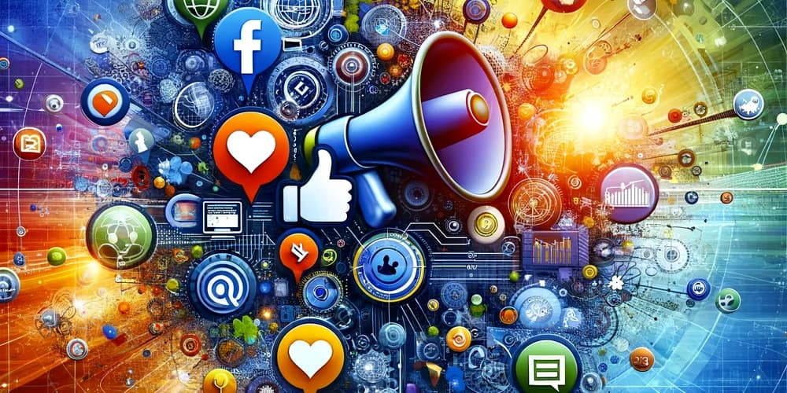

# Portale Spolecznosciowe

## TEAM

1. Kuba Baran - Kuverr - task 2, 3
1. Ignacy Dudziak - Igusilla - task 1, 6
1. Krzysztof Kurlit - scoutwer - task 4, 5

## WPROWADZENIE

The term social in regard to media suggests platforms enable communal activity. Social media can enhance and extend human networks. Users access social media through web-based apps or custom apps on mobile devices. These interactive platforms allow individuals, communities, and organizations to share, co-create, discuss, participate in, and modify user-generated or self-curated content. Social media is used to document memories, learn, and form friendships. They may be used to promote people, companies, products, and ideas.[8] Social media can be used to consume, publish, or share news.

Popular social media platforms with over 100 million registered users include Twitter, Facebook, WeChat, ShareChat, Instagram, Pinterest, QZone, Weibo, VK, Tumblr, Baidu Tieba, Threads and LinkedIn. Depending on interpretation, other popular platforms that are sometimes referred to as social media services include YouTube, Letterboxd, QQ, Quora, Telegram, WhatsApp, Signal, LINE, Snapchat, Viber, Reddit, Discord, and TikTok. Wikis are examples of collaborative content creation.

Social media outlets differ from old media (e.g. newspapers, TV, and radio broadcasting) in many ways, including quality, reach, frequency, usability, relevancy, and permanence. Social media outlets operate in a dialogic transmission system (many sources to many receivers) while traditional media operate under a monologic transmission model (one source to many receivers). For instance, a newspaper is delivered to many subscribers, and a radio station broadcasts the same programs to a city.

## DANE

In a table below you will find statistics on 3 social media platforms: Instagram, Facebook, Twitter. There are statistics on when the platfrom was created, number of downloads, owner.  
|Dana                   |Instagram         |Facebook          |Twitter   |
|-----------------------|------------------|------------------|----------|
|Ilosc pobran (mln)     | 767              | 30               | 368      |
|Rok utworzenia         | 2004             | 2010             | 2006     |
|Wlasciciel             | Mark Zuckerberg  | Mark Zuckerberg  | Elon Musk|

## OBRAZY

